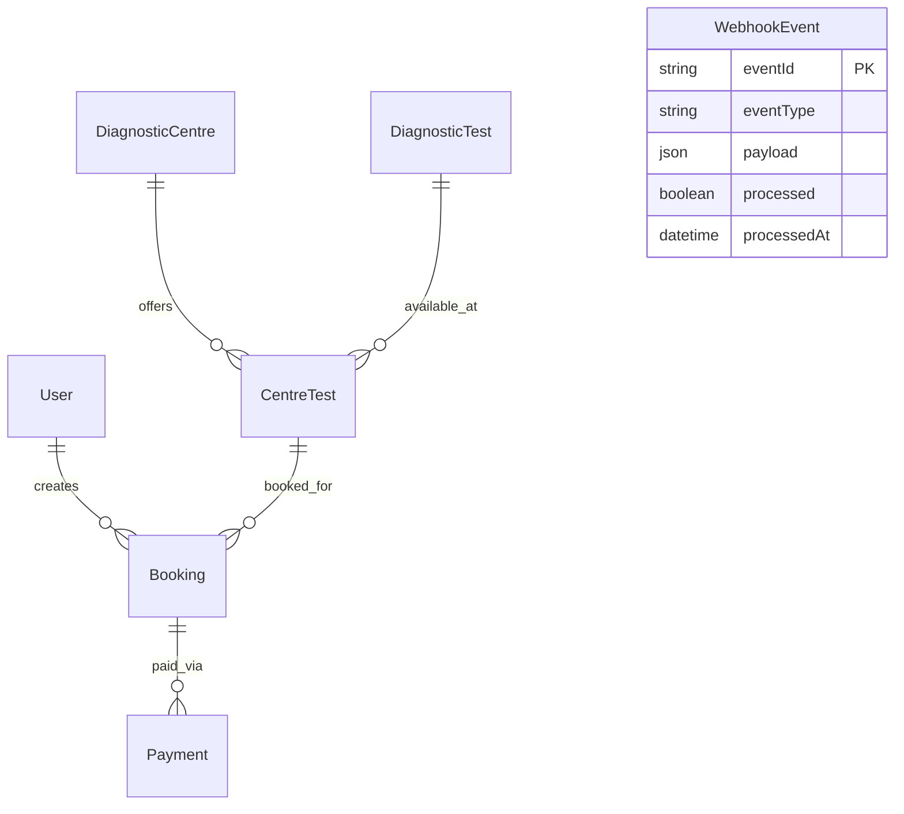

# EVE Healthcare — Diagnostic Booking Backend

A production-grade backend service for diagnostic test bookings with simulated payment processing.

## Tech Stack
| Technology | Description |
|------------|-------------|
| Node.js / Express | Core backend framework for API routing |
| Prisma (PostgreSQL) | Type-safe ORM for database operations |
| Redis | Caching for read-heavy operations |
| Zod | Request body validation |
| Jest & Supertest | Comprehensive unit and integration testing |
| JWT | Stateless authentication mechanism |

## Architecture
This API follows a clear **Service Layer Pattern**:
`Routes (Validation) -> Controllers/Services (Business Logic) -> Database (Prisma)`

Key patterns:
- **catchAsync**: Wrapper to avoid try/catch blocks in express handlers
- **ApiError**: Custom error class for standardized error responses
- **Middleware Chain**: Auth, Role, Validation checks are decoupled
- **Prisma Transactions**: Ensures atomic operations (e.g. Booking + Payment)

## Quick Start

### Prerequisites
- Node.js 18+
- PostgreSQL 15+
- Redis 7+
- Or just Docker

### Option 1: Docker (Recommended)
```bash
git clone <repo>
cd eve-healthcare-backend
docker-compose up -d --build
# Seed the database
docker exec eve_app node prisma/seed.js
# API available at http://localhost:3000
# Swagger docs at http://localhost:3000/api-docs
```

### Option 2: Local Setup
```bash
git clone <repo>
cd eve-healthcare-backend
npm install
cp .env.example .env
# Edit .env with your database credentials
npx prisma migrate dev
npm run db:seed
npm run dev
```

## API Endpoints

| Method | Path | Auth | Description |
|--------|------|------|-------------|
| POST | `/api/v1/auth/signup` | No | Register new user |
| POST | `/api/v1/auth/login` | No | Login and get token |
| GET | `/api/v1/auth/me` | Yes | Get current user profile |
| GET | `/api/v1/centres` | No | List diagnostic centres |
| GET | `/api/v1/centres/:id` | No | Get centre details |
| GET | `/api/v1/centres/:id/tests` | No | List tests available at a centre |
| GET | `/api/v1/tests` | No | List all diagnostic tests |
| GET | `/api/v1/tests/:id/centres` | No | List centres offering a test |
| POST | `/api/v1/bookings` | Yes | Create a booking |
| GET | `/api/v1/bookings` | Yes | List user's bookings |
| GET | `/api/v1/bookings/:id` | Yes | Get booking details |
| PATCH | `/api/v1/bookings/:id/cancel` | Yes | Cancel a pending booking |
| POST | `/api/v1/payments` | Yes | Initiate payment for booking |
| GET | `/api/v1/payments/:bookingId` | Yes | Get payment info for a booking |
| POST | `/api/v1/payments/webhook` | No* | Webhook processor (HMAC secured) |

## API Examples

**Signup**
```bash
curl -X POST http://localhost:3000/api/v1/auth/signup \
  -H 'Content-Type: application/json' \
  -d '{"email":"test@example.com","password":"password123","fullName":"John Doe"}'
```

**Login**
```bash
curl -X POST http://localhost:3000/api/v1/auth/login \
  -H 'Content-Type: application/json' \
  -d '{"email":"test@example.com","password":"password123"}'
```

**Get profile**
```bash
curl -H "Authorization: Bearer <TOKEN>" http://localhost:3000/api/v1/auth/me
```

**List centres**
```bash
curl http://localhost:3000/api/v1/centres?city=Mumbai
```

**Get centre details**
```bash
curl http://localhost:3000/api/v1/centres/<CENTRE_ID>
```

**List tests at a centre**
```bash
curl http://localhost:3000/api/v1/centres/<CENTRE_ID>/tests
```

**List all tests**
```bash
curl http://localhost:3000/api/v1/tests
```

**Create booking**
```bash
curl -X POST http://localhost:3000/api/v1/bookings \
  -H 'Content-Type: application/json' \
  -H "Authorization: Bearer <TOKEN>" \
  -d '{"centreTestId":"<ID>","appointmentDate":"2026-12-01T10:00:00Z"}'
```

**List my bookings**
```bash
curl -H "Authorization: Bearer <TOKEN>" http://localhost:3000/api/v1/bookings?status=PENDING
```

**Get booking detail**
```bash
curl -H "Authorization: Bearer <TOKEN>" http://localhost:3000/api/v1/bookings/<BOOKING_ID>
```

**Cancel booking**
```bash
curl -X PATCH http://localhost:3000/api/v1/bookings/<BOOKING_ID>/cancel \
  -H "Authorization: Bearer <TOKEN>"
```

**Initiate payment**
```bash
curl -X POST http://localhost:3000/api/v1/payments \
  -H 'Content-Type: application/json' \
  -H "Authorization: Bearer <TOKEN>" \
  -d '{"bookingId":"<BOOKING_ID>"}'
```

**Get payment status**
```bash
curl -H "Authorization: Bearer <TOKEN>" http://localhost:3000/api/v1/payments/<BOOKING_ID>
```

**Webhook call (with signature)**
```bash
# Compute webhook signature
BODY='{"eventId":"evt_001","eventType":"payment.completed","transactionId":"TXN_xxx","status":"SUCCESS","bookingId":"xxx"}'
SIGNATURE=$(echo -n $BODY | openssl dgst -sha256 -hmac "test-webhook-secret" | awk '{print $2}')
curl -X POST http://localhost:3000/api/v1/payments/webhook \
  -H 'Content-Type: application/json' \
  -H "x-webhook-signature: $SIGNATURE" \
  -d $BODY
```

## Database Schema


**Key Schema Decisions:**
1. `CentreTest` association table enables per-centre pricing.
2. `Booking.version` field enables optimistic locking to handle concurrency without deadlocks.
3. `WebhookEvent.eventId` is a unique index for idempotent webhook deduplication.
4. `Payment.transactionId` prevents duplicate payments.

## Key Design Decisions
1. **Service Layer Pattern** — Clean separation of concerns makes testing easier.
2. **Optimistic Locking** — Prevents race conditions on concurrent booking state changes.
3. **Webhook Idempotency** — Duplicate webhooks act as no-ops. Avoids multiple credit top-ups or double state changes.
4. **HMAC Signature Verification** — Authenticates webhook origin securely without storing static tokens.
5. **Database Transactions** — Payment records and booking updates are atomic.
6. **Redis Caching** — TTL-based caching for high-read, low-write domains (Centres and Tests).
7. **Consistent Error Handling** — Central `ApiError` format + global handler simplifies client-side parsing.

## Testing

```bash
# Run unit & service test suites (51 tests in-memory, zero external DB required)
npm test

# Run test coverage report
npm run test:coverage

# Run live database integration tests against PostgreSQL
npm run test:integration
```

The test suite is structured into:
- **Unit & Service Tests (`tests/*.unit.test.js`)**: 51 comprehensive tests running in-memory with mocked database states, covering domain invariants, business rules, status state machines, and webhook idempotency without requiring external services.
- **Integration Tests (`tests/auth.test.js`, etc.)**: End-to-end HTTP tests validating Supertest requests against a live PostgreSQL database (`DATABASE_URL_TEST`).

## Important Assumptions
1. Payment simulation uses an approximate 70% success rate on initiation.
2. Appointment dates must strictly be in the future.
3. Only PENDING bookings can be cancelled or paid.
4. Prices are copied into the `Booking` at creation time (price snapshot against changes).
5. A single user can have multiple concurrent bookings.
6. The webhook signature is generated via HMAC-SHA256 using WEBHOOK_SECRET over the serialized JSON payload ({ eventId, eventType, transactionId, status, bookingId }).

## What I Would Improve With More Time
1. Add email/SMS notifications on booking confirmation.
2. Implement appointment slot management to prevent double-booking times.
3. Add Admin endpoints for CRUD operations on Centres and Tests.
4. Implement refresh token rotation for robust security.
5. Request correlation IDs for distributed tracing.
6. Implement the Circuit Breaker pattern for external service calls.
7. Database connection pooling with PgBouncer.
8. Event sourcing for detailed tracking of booking state transitions.
9. OpenTelemetry instrumentation.
10. API versioning strategy out of the gate.

## Project Structure
```text
├── prisma/
│   ├── schema.prisma        # Database schema & models
│   └── seed.js              # Database seed script (centres, tests, pricing, user)
├── src/
│   ├── middleware/          # Express middlewares (auth, errorHandler, rateLimiter, requestLogger, validate)
│   ├── routes/              # Express API route definitions (auth, centres, bookings, payments)
│   ├── services/            # Core business logic & database interactions
│   ├── utils/               # ApiError, catchAsync, pagination helpers
│   ├── config.js            # Centralized environment configuration
│   ├── prisma.js            # PrismaClient singleton instance
│   ├── redis.js             # Redis client & caching helpers
│   ├── logger.js            # Winston structured logger
│   ├── swagger.js           # OpenAPI / Swagger specification
│   ├── app.js               # Express application initialization
│   └── index.js             # Server entry point & graceful shutdown
├── tests/
│   ├── setup.js             # Jest lifecycle hooks & test database cleanup
│   ├── helpers.js           # Test utilities, fixtures & signature helpers
│   ├── auth.test.js         # Authentication endpoint test suite
│   ├── centres.test.js      # Centres & tests catalog test suite
│   ├── bookings.test.js     # Bookings & state transition test suite
│   └── payments.test.js     # Payments & idempotent webhook test suite
├── README.md                # Project documentation
├── Dockerfile               # Production multi-stage Docker build
├── docker-compose.yml       # PostgreSQL, Redis & App orchestration
├── jest.config.js           # Jest configuration
└── package.json             # Dependencies and scripts
```
